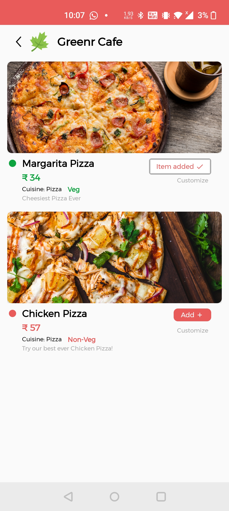

# Restautant-App for Dine In and Home Delivery.

Consists of User and Admin Panel.
Built the app in Java and used Firebase as Database.
User can Book a table and order food for home delivery.
Admin can add all products from Admin Panel and view all the bookings by the user.
Admin can confirm aur reject the bookings by the user.
Admin can add offers, bestsellers on the food items.
